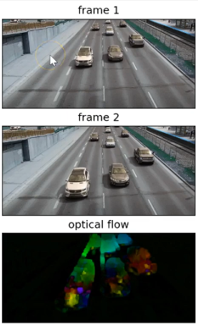

# Optical Flow Visualization using HSV Color Space

This project demonstrates **Optical Flow** computation using two popular algorithms:
1. **Farneback Algorithm** (Dense Optical Flow)
2. **Lucas-Kanade Algorithm** (Sparse Optical Flow)

Both are visualized using the HSV (Hue-Saturation-Value) color space for intuitive motion understanding.



---

## What is Optical Flow?

Optical flow is the pattern of apparent motion of objects between consecutive video frames. Think of it as answering the question: **"Where did each pixel move?"**

### The Basic Idea (Step by Step)

```
Frame 1                    Frame 2
┌─────────────┐           ┌─────────────┐
│      ●      │    →      │         ●   │
│             │           │             │
└─────────────┘           └─────────────┘

The dot moved from left to right!
```

**For every pixel, we compute a motion vector: `(dx, dy)`**

- `dx` = how much the pixel moved horizontally
- `dy` = how much the pixel moved vertically

---

## From Motion Vectors to HSV: The Magic

Once we have the motion vector `(dx, dy)` for each pixel, we compute two things:

### 1. Direction (Angle)
```
angle = atan2(dy, dx)
```
This tells us **which direction** the pixel moved (up, down, left, right, diagonal, etc.)

### 2. Speed (Magnitude)
```
magnitude = √(dx² + dy²)
```
This tells us **how fast** the pixel moved (using Pythagorean theorem!)

### Visual Example:
```
     dy
      ↑
      │   /  ← motion vector (dx, dy)
      │  /
      │ /  angle (direction)
      │/________→ dx
      
      magnitude = length of the arrow
```

---

## Storing Motion in HSV Image

Here's where the magic happens! We map motion to colors:

```
┌─────────────────────────────────────────────────────────┐
│                    HSV IMAGE                            │
├─────────────────────────────────────────────────────────┤
│  H (Hue / Color)      = Direction of motion             │
│  S (Saturation)       = Kept HIGH (255) for vivid colors│
│  V (Value/Brightness) = Speed of motion                 │
└─────────────────────────────────────────────────────────┘
```

### Why This Works So Well:

| Motion Property | HSV Channel | Visual Result |
|-----------------|-------------|---------------|
| **Direction** | Hue (H) | Different colors for different directions |
| **Speed** | Value (V) | Brighter = faster, Darker = slower |
| **Saturation** | S = 255 | Always vivid, easy to see |

### Color Wheel for Direction:

```
                    UP (Magenta/Pink)
                         ↑
                         │
    UP-LEFT (Purple) ←───┼───→ UP-RIGHT (Red)
                         │
    LEFT (Blue) ←────────┼────────→ RIGHT (Red)
                         │
  DOWN-LEFT (Cyan) ←─────┼─────→ DOWN-RIGHT (Yellow)
                         │
                         ↓
                   DOWN (Green)
```

---

## Two Types of Optical Flow

### 1. Dense Optical Flow (Farneback)
- Computes motion for **EVERY pixel** in the frame
- Produces a complete motion map
- More computationally intensive
- Best for: Understanding overall scene motion

### 2. Sparse Optical Flow (Lucas-Kanade)
- Tracks only **specific points** (usually corners)
- Faster and more efficient
- Best for: Object tracking, feature tracking

```
Dense (Farneback)              Sparse (Lucas-Kanade)
┌────────────────┐             ┌────────────────┐
│→→→→→→→→→→→→→→→→│             │    ●→          │
│→→→→→→→→→→→→→→→→│             │         ●→     │
│→→→→→→→→→→→→→→→→│             │  ●→            │
│→→→→→→→→→→→→→→→→│             │        ●→      │
└────────────────┘             └────────────────┘
  Every pixel tracked           Only key points tracked
```

---

# PART 1: Farneback Algorithm (Dense Optical Flow)

Farneback computes optical flow for **every pixel** using polynomial expansion.

## Code Breakdown

### Step 1: Import Libraries

```python
import cv2
import numpy as np
```

| Library | Purpose |
|---------|---------|
| `cv2` | OpenCV library for computer vision |
| `numpy` | Numerical operations on arrays |

---

### Step 2: Open the Video

```python
capture = cv2.VideoCapture("input.mp4")
if not capture.isOpened():
    raise RuntimeError("Cannot open video file")
```

**What it does:**
- Opens the video file for reading
- Checks if the video opened successfully
- Raises an error if it fails (better than crashing later!)

---

### Step 3: Read the First Frame

```python
ret, frame1 = capture.read()
if not ret:
    raise RuntimeError("Cannot read first frame")

prvs = cv2.cvtColor(frame1, cv2.COLOR_BGR2GRAY)
```

**What it does:**
- Reads the first frame from the video
- `ret` = True if successful, False if failed
- Converts to **grayscale** because optical flow works on brightness, not color

**Why grayscale?**
1. Simpler: 1 channel instead of 3
2. Optical flow tracks **intensity changes**, not color changes
3. Faster computation

---

### Step 4: Create the HSV Canvas

```python
hsv_mask = np.zeros_like(frame1)
hsv_mask[..., 1] = 255
```

**What it does:**
- Creates a black image same size as our video frame
- Sets Saturation to 255 (maximum) for vivid colors

```
hsv_mask has 3 channels:
┌─────────────────────────────────────┐
│ Index 0: Hue        → Will store direction │
│ Index 1: Saturation → Set to 255 (vivid)   │
│ Index 2: Value      → Will store speed     │
└─────────────────────────────────────┘
```

---

### Step 5: Main Loop - Read Each Frame

```python
while True:
    ret, frame2 = capture.read()
    if not ret:
        break
```

**What it does:**
- Reads frames one by one
- Stops when video ends

---

### Step 6: Convert Current Frame to Grayscale

```python
next_gray = cv2.cvtColor(frame2, cv2.COLOR_BGR2GRAY)
```

Converts the new frame to grayscale for comparison with previous frame.

---

### Step 7: The Core - Farneback Optical Flow

```python
flow = cv2.calcOpticalFlowFarneback(
    prvs, next_gray, None,
    0.5, 3, 15, 3, 5, 1.2, 0
)
```

**This is where the magic happens!** This function compares two frames and calculates how each pixel moved.

**Parameters Explained (Beginner-Friendly):**

| Parameter | Value | What it means |
|-----------|-------|---------------|
| `prvs` | - | Previous frame (grayscale) |
| `next_gray` | - | Current frame (grayscale) |
| `None` | - | Let OpenCV create the output array |
| `pyr_scale` | 0.5 | Each pyramid level is half the size |
| `levels` | 3 | Number of image pyramid levels |
| `winsize` | 15 | Size of the averaging window |
| `iterations` | 3 | Number of iterations per level |
| `poly_n` | 5 | Size of neighborhood for polynomial |
| `poly_sigma` | 1.2 | Gaussian standard deviation |
| `flags` | 0 | Default operation mode |

**What does it output?**
```
flow.shape = (height, width, 2)

flow[y, x, 0] = dx  ← How much pixel (x,y) moved horizontally
flow[y, x, 1] = dy  ← How much pixel (x,y) moved vertically
```

---

### Step 8: Convert to Polar Coordinates (Direction & Speed)

```python
mag, ang = cv2.cartToPolar(flow[..., 0], flow[..., 1])
```

**This converts (dx, dy) to (magnitude, angle):**

```
Input: dx, dy (how much moved in x and y)
Output:
  - mag = √(dx² + dy²)   ← SPEED (how fast)
  - ang = atan2(dy, dx)  ← DIRECTION (which way)
```

| Output | Meaning |
|--------|---------|
| `mag` | Speed of motion (bigger = faster) |
| `ang` | Direction in radians (0 to 2π) |

---

### Step 9: Map to HSV Channels

```python
hsv_mask[..., 0] = ang * 180 / np.pi / 2
hsv_mask[..., 2] = cv2.normalize(mag, None, 0, 255, cv2.NORM_MINMAX)
```

**Line 1: Direction → Hue (Color)**
```
ang (radians: 0 to 2π)
  → multiply by 180/π to get degrees (0 to 360)
  → divide by 2 to fit OpenCV's hue range (0 to 180)
```

**Line 2: Speed → Value (Brightness)**
```
mag (any range)
  → normalize to 0-255
  → bright = fast motion
  → dark = slow/no motion
```

---

### Step 10: Convert HSV to BGR and Display

```python
flow_bgr = cv2.cvtColor(hsv_mask, cv2.COLOR_HSV2BGR)
cv2.imshow("Optical Flow (HSV)", flow_bgr)
```

**What it does:**
- Converts from HSV to BGR (OpenCV's display format)
- Shows the colorful motion visualization!

---

### Step 11: Keyboard Controls

```python
k = cv2.waitKey(20) & 0xFF
if k == ord('e'):
    break
elif k == ord('s'):
    cv2.imwrite("frame.png", frame2)
    cv2.imwrite("optical_flow.png", flow_bgr)
```

| Key | Action |
|-----|--------|
| `e` | **Exit** the program |
| `s` | **Save** the current frame and flow image |

---

### Step 12: Update for Next Iteration

```python
prvs = next_gray
```

The "current" frame becomes the "previous" frame for the next loop iteration.

---

### Step 13: Cleanup

```python
capture.release()
cv2.destroyAllWindows()
```

Releases video resources and closes windows.

---

# PART 2: Lucas-Kanade Algorithm (Sparse Optical Flow)

Lucas-Kanade tracks **specific points** (usually corners) rather than every pixel. It's faster and great for object tracking!

## How Lucas-Kanade Works

```
Step 1: Find good points to track (corners)
Step 2: For each point, calculate where it moved
Step 3: Draw the movement as lines/circles
Step 4: Repeat for each frame
```

## Code Breakdown

### Step 1: Import Libraries

```python
import cv2
import numpy as np
```

Same as Farneback - we need OpenCV and NumPy.

---

### Step 2: Open Video and Read First Frame

```python
capture = cv2.VideoCapture("input.mp4")
if not capture.isOpened():
    raise RuntimeError("Cannot open video file")

ret, old_frame = capture.read()
if not ret or old_frame is None:
    raise RuntimeError("Cannot read first frame")

old_gray = cv2.cvtColor(old_frame, cv2.COLOR_BGR2GRAY)
```

Same as Farneback - open video, read first frame, convert to grayscale.

---

### Step 3: Find Points to Track (Shi-Tomasi Corner Detection)

```python
feature_params = dict(
    maxCorners=200,        # maximum number of points
    qualityLevel=0.3,      # higher = fewer but stronger corners
    minDistance=7,         # minimum distance between corners
    blockSize=7
)

p0 = cv2.goodFeaturesToTrack(old_gray, mask=None, **feature_params)
```

**What it does:**
This finds "good features to track" - usually corners, because:
- Corners are unique and easy to identify
- Edges alone are ambiguous (which part of the edge?)
- Flat regions have no distinctive features

**Parameters Explained:**

| Parameter | Value | Meaning |
|-----------|-------|---------|
| `maxCorners` | 200 | Track up to 200 points |
| `qualityLevel` | 0.3 | Quality threshold (0-1, higher = fewer but better corners) |
| `minDistance` | 7 | Minimum 7 pixels between tracked points |
| `blockSize` | 7 | Size of neighborhood for corner detection |

**Visual example:**
```
Image with corners detected:
┌─────────────────┐
│  ●              │  ● = detected corner (good feature)
│     ┌───┐       │
│     │   │●      │  Corners are where edges meet
│     │   │       │
│     └───┘●      │
│              ●  │
└─────────────────┘
```

---

### Step 4: Lucas-Kanade Parameters

```python
lk_params = dict(
    winSize=(15, 15),      # search window size
    maxLevel=2,            # pyramid levels
    criteria=(cv2.TERM_CRITERIA_EPS | cv2.TERM_CRITERIA_COUNT, 10, 0.03)
)
```

**Parameters Explained:**

| Parameter | Value | Meaning |
|-----------|-------|---------|
| `winSize` | (15, 15) | Search for motion in a 15x15 window |
| `maxLevel` | 2 | Use image pyramid with 3 levels (0, 1, 2) |
| `criteria` | ... | When to stop iterating |

**What is an image pyramid?**
```
Level 2: [small image]     ← Find rough motion first
Level 1: [medium image]    ← Refine the motion
Level 0: [original size]   ← Final precise motion
```
This helps track fast-moving objects!

---

### Step 5: Create Drawing Mask

```python
mask = np.zeros_like(old_frame)
```

Creates a blank canvas to draw the motion trails on.

---

### Step 6: Main Loop - Track Points

```python
while True:
    ret, frame = capture.read()
    if not ret or frame is None:
        break

    frame_gray = cv2.cvtColor(frame, cv2.COLOR_BGR2GRAY)
```

Read each frame and convert to grayscale.

---

### Step 7: Calculate Optical Flow (Lucas-Kanade)

```python
p1, st, err = cv2.calcOpticalFlowPyrLK(old_gray, frame_gray, p0, None, **lk_params)
```

**The core Lucas-Kanade function!**

**Inputs:**
- `old_gray`: Previous frame
- `frame_gray`: Current frame
- `p0`: Points to track from previous frame

**Outputs:**
- `p1`: New positions of the tracked points
- `st`: Status array (1 = tracked successfully, 0 = lost)
- `err`: Error for each point

```
Frame 1          Frame 2
   p0       →       p1
   ●────────────────●
   
   "Where did this point move to?"
```

---

### Step 8: Filter Good Points

```python
if p1 is None or st is None:
    break

good_new = p1[st.flatten() == 1]
good_old = p0[st.flatten() == 1]
```

**What it does:**
- Keeps only points that were successfully tracked (`st == 1`)
- Removes points that were lost (went off-screen, occluded, etc.)

---

### Step 9: Draw the Motion Trails

```python
for (new, old) in zip(good_new, good_old):
    a, b = new.ravel()   # new position (x, y)
    c, d = old.ravel()   # old position (x, y)

    # Draw line from old → new position
    mask = cv2.line(mask, (int(c), int(d)), (int(a), int(b)), (0, 255, 0), 2)
    
    # Draw circle at new position
    frame = cv2.circle(frame, (int(a), int(b)), 3, (0, 0, 255), -1)
```

**What it draws:**
```
┌─────────────────────────────────┐
│                                 │
│    ●────────────────●           │
│    (old)    line    (new)       │
│    green line shows movement    │
│    red circle shows current pos │
│                                 │
└─────────────────────────────────┘
```

---

### Step 10: Combine and Display

```python
output = cv2.add(frame, mask)
cv2.imshow("Lucas-Kanade Optical Flow (Sparse)", output)
```

Overlays the motion trails on the current frame and displays it.

---

### Step 11: Keyboard Controls

```python
k = cv2.waitKey(20) & 0xFF
if k == ord('e'):
    break
elif k == ord('r'):
    # Refresh - re-detect features
    p0 = cv2.goodFeaturesToTrack(frame_gray, mask=None, **feature_params)
    mask = np.zeros_like(old_frame)
    old_gray = frame_gray.copy()
    continue
elif k == ord('s'):
    cv2.imwrite("lucas_frame.png", frame)
    cv2.imwrite("lucas_tracks.png", output)
```

| Key | Action |
|-----|--------|
| `e` | **Exit** the program |
| `r` | **Refresh** - find new points to track |
| `s` | **Save** current images |

**Why refresh?**
Points can drift or get lost over time. Press `r` to find fresh corners!

---

### Step 12: Update for Next Frame

```python
old_gray = frame_gray.copy()
p0 = good_new.reshape(-1, 1, 2)
```

- Current frame becomes previous frame
- Current point positions become the "old" positions for next iteration

---

### Step 13: Cleanup

```python
capture.release()
cv2.destroyAllWindows()
```

---

# Comparison: Farneback vs Lucas-Kanade

| Feature | Farneback (Dense) | Lucas-Kanade (Sparse) |
|---------|-------------------|----------------------|
| **What it tracks** | Every pixel | Selected points only |
| **Speed** | Slower | Faster |
| **Output** | Full motion field | Point trajectories |
| **Visualization** | HSV color image | Lines and circles |
| **Best for** | Scene motion analysis | Object tracking |
| **Memory** | Higher | Lower |

---

## Visual Output Interpretation (Farneback)

The HSV visualization shows motion direction as colors:

| Color | Motion Direction |
|-------|-----------------|
| 🔴 Red | Right |
| 🟡 Yellow | Down-Right |
| 🟢 Green | Down |
| 🔵 Cyan | Down-Left |
| 🔵 Blue | Left |
| 🟣 Magenta | Up-Left |
| 🔴 Red/Pink | Up |

**Brightness indicates speed:**
- **Bright** = Fast motion
- **Dark** = Slow or no motion

---

## Requirements

```
opencv-python
numpy
```

Install with:
```bash
pip install opencv-python numpy
```

---

## Usage

1. Place your video file as `input.mp4` in the same directory
2. Run the notebook cell
3. Use keyboard controls:
   - `s` to save frames
   - `e` to exit
   - `r` to refresh points (Lucas-Kanade only)

---

## Quick Summary

```
OPTICAL FLOW = Tracking pixel movement between frames

For each pixel/point:
  1. Compute motion vector (dx, dy)
  2. Calculate direction: angle = atan2(dy, dx)
  3. Calculate speed: magnitude = √(dx² + dy²)
  4. Visualize using HSV:
     - H (Hue)   = Direction → Color
     - S (Sat)   = 255 (always vivid)
     - V (Value) = Speed → Brightness
```

---

## Applications

- **Video Stabilization** - Detect unwanted camera motion
- **Object Tracking** - Follow moving objects
- **Action Recognition** - Understand motion patterns
- **Autonomous Vehicles** - Detect moving obstacles
- **Video Compression** - Predict frame content based on motion
- **Sports Analysis** - Track player and ball movements
- **Gesture Recognition** - Detect hand/body movements


